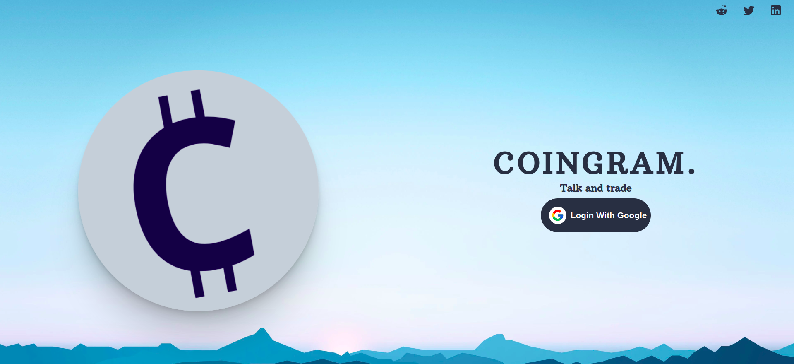

This website is an early working prototype of community-based cryptocurrency website.

Contents
==
* [Why?](#why)
* [Installation](#installation)
* [Execution](#execution)
* [Live Build](#live)

### Why?
Trading can be overbearing for anynone who wants to attempt it, be it a beginner who has never traded before or even traders who have delved in the idea but still do not have a proper grasp of concepts. With this issue in mind, we decided that our solution should be able to tackle te problem by:

+ Building a medium for public communication between all users of the platform
+ Acting as a one-stop source of information for everything cryptocurrency-related, from latest news to cryptocurrency ranking as well as detailed information on each cryptocurrency

### Installation
---
1. Clone the repository
2.  `$ npm install`
3.  Thats it, the application should be ready

### Execution
To run the application,run the command;

`$ npm start`

### Live 
The live version of the application can be found at https://besquare-final-project.web.app/

This is a collaborative project completed by 6 members from Deriv's BeSquare project. Capabilities of this website are a reflection of the skills accumulated throughout the 6-months-long graduate program
